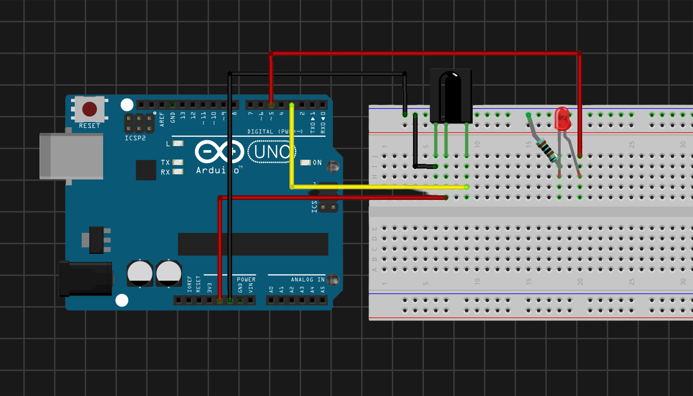

## 02 - IR LED Brightness Control

Control LED intensity using an IR Remote with step-acceleration logic.

### Components
- Arduino Uno
- IR Receiver Module
- IR Remote Control
- Red Led
- x1 Resistor (1 K$\Omega$)
  
| Circuit Schematic | Demo |
| :---: | :---: |
|  |  | |
